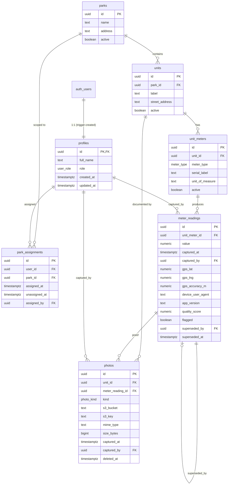

# Database schema — entity relationships

The diagram below renders natively on GitHub/GitLab and most Markdown viewers.

## Relationship cheat sheet

| Parent | Child | Cardinality | Notes |
|---|---|---|---|
| `auth.users` | `profiles` | 1 — 1 | Auto-created by trigger on signup. |
| `parks` | `units` | 1 — N | A park has many lots/sites. |
| `units` | `unit_meters` | 1 — N | "Some have water + gas + electric, some have only one." |
| `unit_meters` | `meter_readings` | 1 — N | Append-only readings. |
| `meter_readings` | `meter_readings` | 0..1 self | Corrections via `superseded_by`. |
| `units` | `photos` | 1 — N (kind=`unit_reference`) | Setup photos of the meter location. |
| `meter_readings` | `photos` | 1 — N (kind=`meter_reading`) | Proof-of-reading photos. |
| `parks` | `park_assignments` | 1 — N | Who's reading the park, with history. |
| `profiles` | `park_assignments` | 1 — N | One active row per user (partial unique index). |
| `profiles` | `meter_readings` | 1 — N (`captured_by`) | Forensic. |
| `profiles` | `photos` | 1 — N (`captured_by`) | Forensic. |

## Append-only correction flow

Readings are never updated or deleted by readers. To correct a wrong reading:

1. Insert a *new* `meter_readings` row with the correct value.
2. (Admin) update the wrong row, setting `superseded_by` → new row's id, `superseded_at`, `superseded_by_user`, and `supersede_reason`.
3. The `current_park_progress` view and any "latest reading" queries filter on `superseded_by IS NULL`.

The original wrong row stays in the database. Full audit trail.

## RLS scoping at a glance

| Table | Reader can read | Reader can write |
|---|---|---|
| `parks` | only `current_user_park_id()` | — |
| `units` | only own park | — |
| `unit_meters` | only own park | — |
| `meter_readings` | only own park | INSERT for own park only; no UPDATE/DELETE |
| `photos` | only own park | INSERT for own park only |
| `park_assignments` | own assignments | — |
| `profiles` | own row | UPDATE own non-role fields |

Admins (`profiles.role = 'admin'`) bypass all scoping via the `is_admin()` SECURITY DEFINER function.
